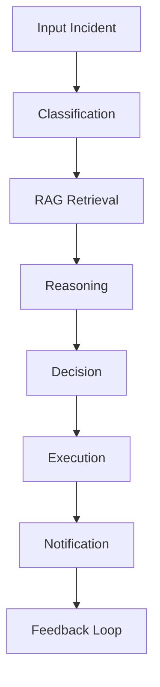
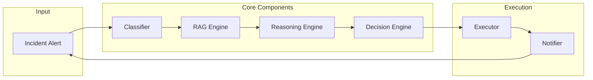

# 🚀 FlowFix Agent

[](https://www.python.org/downloads/)
[](https://opensource.org/licenses/MIT)
[](https://github.com/yourusername/Log_Analyzer_CV/actions)
[](https://codecov.io/gh/yourusername/Log_Analyzer_CV)
[](https://github.com/yourusername/Log_Analyzer_CV/issues)
[](https://github.com/yourusername/Log_Analyzer_CV/stargazers)
[](https://github.com/yourusername/Log_Analyzer_CV/network/members)
[](https://github.com/yourusername/Log_Analyzer_CV/commits/main)

**Autonomous AI Agent for Incident Detection and Resolution in Order Processing Systems** 🛠️

 <!-- Replace with actual demo GIF/image -->

---

## 📋 Table of Contents
- [🎯 Priority Definition](#-priority-definition)
- [🤖 Agent Behavior](#-agent-behavior)
- [⚡ Decision Intelligence](#-decision-intelligence)
- [🧩 Real-World Scenarios](#-real-world-scenarios)
- [🧠 Why This Matters](#-why-this-matters)
- [⚖️ Comparison with Standard LLM](#️-comparison-with-standard-llm)
- [🏗️ Architecture](#️-architecture)
- [🔧 Features](#-features)
- [📁 Project Structure](#-project-structure)
- [🚀 How to Run](#-how-to-run)
- [📊 Benchmark](#-benchmark)
- [🧠 How the Agent Works](#-how-the-agent-works)
- [📝 Notes](#-notes)
- [🤝 Contributing](#-contributing)
- [📄 License](#-license)

---

## 🎯 Priority Definition

This project targets a high-impact operational problem:

> **Reducing MTTR (Mean Time To Resolution) for order-processing failures** ⏱️

In real-world systems, repetitive incidents such as:
- 🔄 Workflow failures
- 📊 Faulty order data
- 📦 Batch processing issues
- 🚨 False alerts

require manual debugging and intervention.

**FlowFix Agent automates:**
- 🔍 Detection
- 🧠 Reasoning
- 💡 Decision-making
- ⚙️ Recovery execution

The focus is on **high-frequency, high-impact operational failures**, not generic AI tasks. 🎯

---

## 🤖 Agent Behavior

FlowFix is designed as an **AI-native decision-making agent**, not just a backend service. 🤖

It follows:

**Perception → Reasoning → Decision → Action → Communication** 🔄

### Pipeline



Unlike traditional systems, the agent can also decide:

> **"Do nothing" when an alert is misleading** 🤷‍♂️

---

## ⚡ Decision Intelligence

The agent does NOT blindly execute actions. 🧠

It evaluates confidence and decides:

- **≥ 0.75 → auto execute** ✅
- **0.50–0.74 → execute with warning** ⚠️
- **< 0.50 → escalate** 📈
- **special cases → no_action** 🚫

This prevents unnecessary retries and reduces operational noise. 🔇

---

## 🧩 Real-World Scenarios Covered

### 1. Bulk Orders Stuck in CREATED 📦
- Detects spike in stuck orders
- Identifies workflow bottlenecks
- Safely retries workflows

### 2. Workflow Failure (Upstream vs Downstream) 🔄
- Downstream issues → retry
- Upstream/data issues → escalate

### 3. Faulty Order in File (PayPal case) 💳
- Detects missing billing address
- Removes faulty order
- Reprocesses batch

### 4. Delayed Batch Export (False Alert) ⭐
- Detects delay + spike pattern
- Returns **no_action**
- Prevents unnecessary intervention

---

## 🧠 Why This Matters

Most systems:
- React blindly to alerts 🚨
- Trigger unnecessary retries 🔄
- Increase operational noise 🔊

FlowFix Agent:
- Understands context 📚
- Avoids false positives ❌
- Reduces unnecessary actions ➖
- Improves operational efficiency 📈

---

## ⚖️ Comparison with Standard LLM

| Capability            | LLM | FlowFix Agent |
|----------------------|-----|--------------|
| Explain issue        | ✅  | ✅ |
| Decide action        | ❌  | ✅ |
| Execute recovery     | ❌  | ✅ |
| Avoid false alerts   | ❌  | ✅ |
| Multi-step recovery  | ❌  | ✅ |

---

## 🏗️ Architecture



---

## 🔧 Features

- 🚀 FastAPI backend with lightweight debug UI (`/`)
- 🏷️ Rule-based issue classification for real-world failure patterns
- 📚 Local RAG-style retrieval from `app/data/incidents.json`
- 🎛️ Decision engine with confidence-based execution control
- 📋 Multi-step recovery plan generation
- 🔄 Simulated execution with failure handling and fallback continuation
- 📢 Smart notification routing based on severity and confidence
- 📊 Benchmark system with performance scoring

---

## 📁 Project Structure

```
app/
├── main.py          # FastAPI entrypoint 🚀
├── routes.py        # API routes 🛣️
├── schemas.py       # Request/response models 📋
├── core/
│   ├── agent_core.py    # Orchestration logic 🎯
│   ├── classifier.py    # Issue classification 🏷️
│   └── reasoning.py     # Decision logic 🧠
├── services/
│   ├── rag_engine.py    # Incident retrieval 📚
│   ├── executor.py      # Action execution simulation ⚙️
│   └── notifier.py      # Notification logic 📢
└── data/
    ├── incidents.json   # Historical cases 📜
    └── test_cases.json  # Benchmark dataset 🧪

evaluation/
└── scorer.py        # Benchmark scoring 📊
```

---

## 🚀 How to Run

### Prerequisites
- Python 3.10+ 🐍
- pip 📦

### Installation
```bash
pip install -r requirements.txt
```

### Start Server
```bash
uvicorn app.main:app --reload
```

### Access
- **UI**: http://127.0.0.1:8000/ 🌐
- **Docs**: http://127.0.0.1:8000/docs 📖
- **Health**: http://127.0.0.1:8000/health ❤️

### 📡 API Endpoints

#### POST /analyze
Analyzes incident text and returns decision + execution plan.

**Example Request:**
```json
{
  "input": "Workflow timed out while waiting on downstream payment service"
}
```

**Example Response:**
```json
{
  "issue_type": "workflow_failure",
  "decision": "retry_workflow",
  "confidence": 0.69,
  "execution_mode": "warning",
  "decision_source": "rag_enhanced",
  "severity": "medium",
  "impact": {
    "orders_affected": 1,
    "scope": "single"
  },
  "why": [
    "Downstream timeout detected",
    "Similar past cases resolved via retry"
  ],
  "recovery_plan": [
    "check_downstream",
    "retry_workflow",
    "validate_state"
  ],
  "execution_log": [],
  "timeline": [],
  "notification": "email",
  "correlated_incidents": false
}
```

#### POST /benchmark
Runs evaluation using test cases.

**Metrics:**
- Detection accuracy 🎯
- Action accuracy ✅
- Resolution success 🏆
- Response time ⏱️

---

## 📊 Benchmark

The system evaluates performance across predefined scenarios.

**Final Score: ~9000 / 10000** 🏅

Based on:
- Detection accuracy
- Action correctness
- Resolution success
- Response time

 <!-- Replace with actual chart -->

---

## 🧠 How the Agent Works

1. **Classification** 🏷️
   - Maps raw input into issue types.

2. **Retrieval (RAG)** 📚
   - Finds similar past incidents from local dataset.

3. **Reasoning** 🧠
   - Determines safest action based on:
     - Input signals
     - Historical cases
     - Failure patterns

4. **Decision** 💡
   - Applies confidence-based execution control.

5. **Execution** ⚙️
   - Simulates recovery steps with fallback handling.

6. **Notification** 📢
   - Routes alerts based on severity and confidence.

---

## 🧠 LLM Usage

The system uses a hybrid approach:

- Deterministic reasoning (default) 🔒
- Optional LLM integration (e.g., Grok) 🤖

This ensures:
- Reliability 🔧
- Explainability 📖
- Extensibility to AI-native workflows 🚀

---

## 📝 Notes

- Execution is simulated (no real system calls) 🎭
- RAG is JSON-based (no embeddings) 📄
- Some steps include random failure simulation 🎲

---

## 🤝 Contributing

Contributions are welcome! Please feel free to submit a Pull Request. 🔄

1. Fork the repository 🍴
2. Create your feature branch (`git checkout -b feature/AmazingFeature`) 🌟
3. Commit your changes (`git commit -m 'Add some AmazingFeature'`) 💾
4. Push to the branch (`git push origin feature/AmazingFeature`) 📤
5. Open a Pull Request 📋

---

## 📄 License

This project is licensed under the MIT License - see the [LICENSE](LICENSE) file for details. 📜

---

*Made with ❤️ by [Your Name](https://github.com/yourusername)*

CORS is open for local development

🎯 **Key Takeaway**

FlowFix Agent is not just an API — it is a decision-making system that:

- Prioritizes real operational problems 🎯
- Reasons before acting 🧠
- Avoids unnecessary actions 🚫
- Demonstrates AI-native system design 🤖